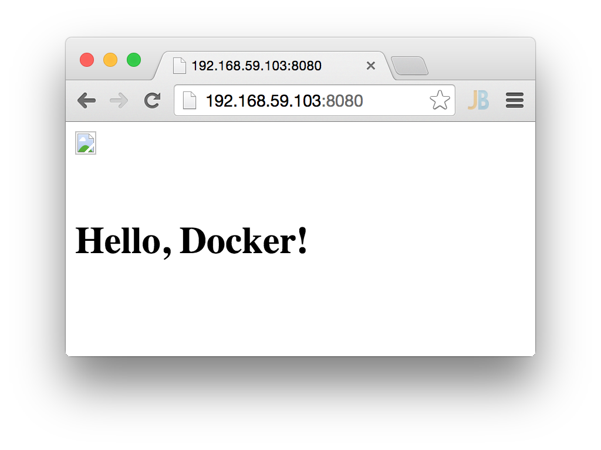

gradle-docker-plugin-sample DRAFT
=================================

a beginners java-hello-world-sample for the [gradle-docker-plugin] (https://github.com/bmuschko/gradle-docker-plugin) Version 0.71. It includes
* some steps for first time setup of boot2docker
* shows how to build a docker image for a hello-world-java-application using gradle
* run the docker image

It runs with Oracle Java 8 (default) or OpenJDK 7.

#### prepare boot2docker
Boot2docker must be installed. For MAC OS, follow [docker installation mac] (https://docs.docker.com/installation/mac/).
Start boot2docker.app. If it is not already started type in the console
```bash
boot2docker up
docker version
boot2docker shellinit
```

not sure - it might be required to set some port mappings
```bash
boot2docker down
VBoxManage modifyvm "boot2docker-vm" --natpf1 "tcp-port8080,tcp,,8080,,8080"
boot2docker up
```

try if boot2docker pull works - e.g.
```bash
docker pull dockerfile/java:oracle-java8
```

#### get this java sample, build it and run it
open a new console and run the following
```bash
git clone https://github.com/muenchhausen/gradle-docker-plugin-sample.git
cd gradle-docker-plugin-sample
./gradlew dockerBuildImage
```
if it is successful, you will see an image id.

For using the docker commands, you might need to set ```DOCKER_HOST``` and other env Variables that came from ```boot2docker shellinit``` first.
If you are unsure about the image id, list it and choose it:
```bash
docker images
```

Then run:
```bash
docker run -d -p 8080:8080 <imageId>
```

finally: Open a browser with the boot2docker IP address and Port 8080, e.g. http://192.168.59.103:8080/


